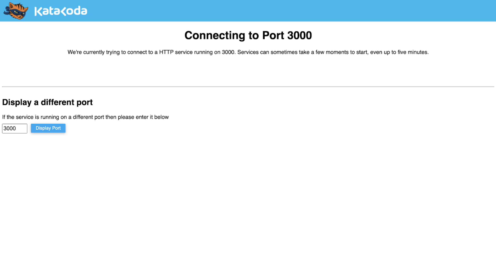

# Starting our microservices with Docker Compose

This SLO workshop uses two docker images in order to build a microservices environment for a small scale e-commerce web app called `storedog`. The first image is a fully functioning version of the application, the second image purposely introduces issues that will cause errors and poor latency in the application. Both images are already instrumented to work with Datadog APM.

Open the IDE by clicking on the **IDE** tab. It takes a few seconds to load and may display an error before loading fully. You should see a `docker-compose.yml` file. After clicking to open it in the IDE, you'll see the exact services you are running.

When the lab loaded, this image was automatically started.

You can check that storedog is successfully running by clicking on the `storedog` tab next to the `Terminal` tab to your right. **Note:** It takes a little while for the environment to fully ramp up, so if you see a page like this one just wait a little bit longer before refreshing the page:

In order to start populating Datadog with some interesting data in a short period of time, you can run a command to simulate traffic to the app. Click on the following command to run it in a second terminal window:

`cd /ecommerce-workshop/ && ./gor --input-file-loop --input-file requests_0.gor --output-http "http://localhost:3000"`{{execute T2}}

In the next step we'll explore the running application and start thinking about where it would be most valuable to set SLOs.
