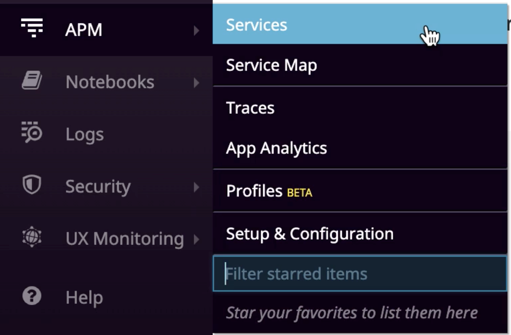
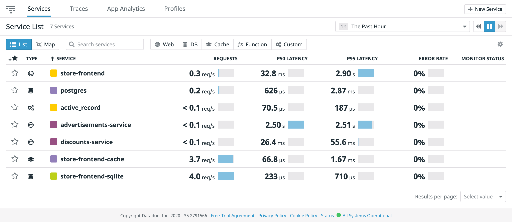

# Exploring our application and its user journeys  

Take the opportunity to explore the web app by clicking on the `storedog` tab in the Katacoda terminal to open it in your browser.  

Sign in into Datadog, and check to see if the services have appeared by going to the APM Services page by navigating to **APM -> Services**, or by clicking https://app.datadoghq.com/apm/services. 

The page should look something like this: 

Eventually, when you switch to using the broken image you'll see parts of the application experiencing high error rates.

Exploring the application is an important step in the SLO creation process. Before we think about what SLOs to set, we need to make sure we understand what important aspects of the application need SLOs in the first place. What would you expect to be able to do with an e-commerce application like this one? What are the critical user journeys that we would want to ensure are working well?

For any e-commerce application application, we would reasonably expect to be able to login, search for items, view item details, manage items in our cart, and check out our items for purchase. 

In the interest of time, let's focus on one particular user journey: managing items in your cart. Go into storedog and try adding at least 3 different items to your cart.

If this particular user journey were to become unreliable, our hypothetical customers might not be able complete the purchases that they want to make. Since this user journey is so critical to this application, that makes it a great candidate for setting an SLO to ensure its reliability.

Now that we've selected a critical user journey, what Service Level Indicators (SLIs) should we track? Since this is a request/response endpoint, it would be a good idea to set an SLO on its success rate and its latency.

Let's head back into Datadog to get started!
