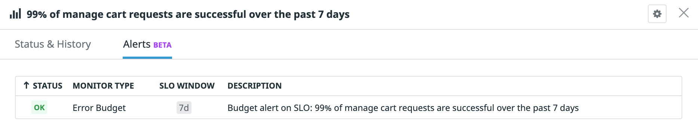

# Setting an alert on our SLO

In order to avoid overspending your error budget, you need to be paying attention to when your SLO's health is at risk. Overspending your error budget means you've violated your SLO and might be on the hook to compensate your clients as per the stipulations in your SLA. Once you've gotten close to 100% consumption of your error budget, the team responsible for that SLO or user journey should switch priorities from feature development to reliability work to prevent any breaches.

To that end, you can use SLO Alerts to proactively manage the health of your SLOs! There are two kinds of SLO Alerts: Error Budget Alerts and Burn Rate Alerts. We'll be covering both in this exercise, starting with Error Budget Alerts. Error Budget Alerts notify you when a certain percentage of your error budget has been consumed. Error Budget Alerts are great for helping you enforce an agreed upon "cutoff" point for error budget consumption, ensuring you and your team are made aware of when to switch priorities to reliability work. 

Now that we've created an SLO, let's set an Error Budget Alert on it! 

To do this, go back to the details side panel of your SLO and select the `Set up Alerts` button. This will take you to a configuration page for you to set your Error Budget Alert. In a real world scenario, it would make sense to get notified a bit before we've completely spent our error budget, so let's set our thresholds accordingly.

1. Set the alert threshold to `90%` so that the monitor is configured to notify us before our error budget is 100% consumed
2. Set the optional warning threshold. `75%` would be a sensible choice.
3. Enter a monitor message in the large text box. In a real environment, you could type in `@` and select your name to receive an email notification.

Save the monitor when you're done!

You'll see the new alert appears under the `Alerts` tab in your SLO's side panel. Initially it will be in `NO DATA` since it was just created, before quickly transitioning to `OK` as we haven't introduced any errors yet.

In the next step, we'll set a Burn Rate Alert on our SLO as well.
