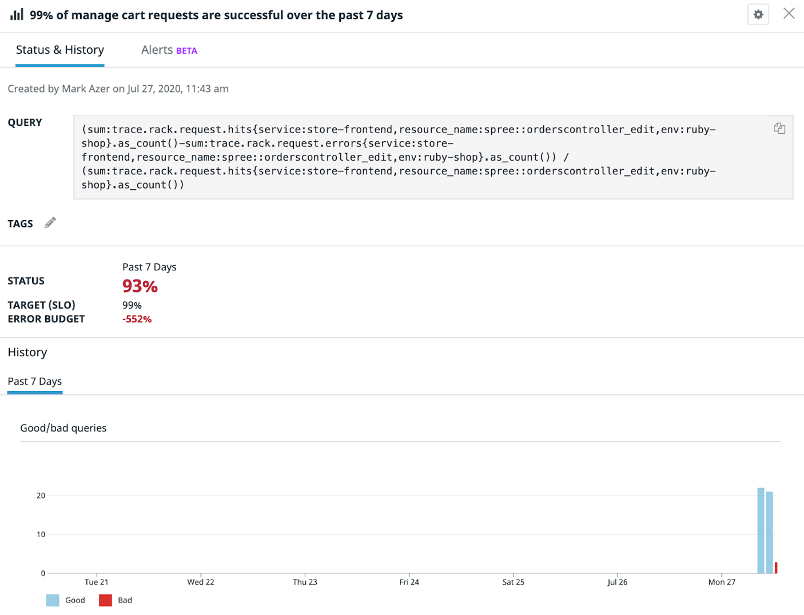
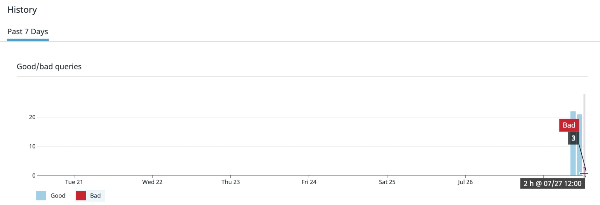
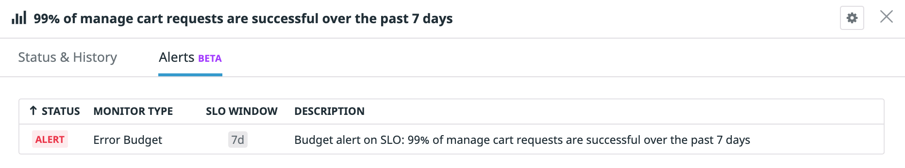

# Modeling failure in our systems

Let's start introducing errors by switching images! This will allow us to explore what happens to our SLO's status and error budget and will cause our Error Budget Monitor to alert. 
 
In a real world scenario, a popular e-commerce site will receive a lot of traffic and there is eventually going to be some errors introduced in the application for various reasons. For now we are dealing with our hypothetical web store. 

Close all storedog tabs that you have open in your browser.
 
In the first terminal window where you currently have docker-compose running, press CTRL + C to stop the command. Wait 10 to 15 seconds until docker-compose gracefully stops and you regain the ability to type commands in the terminal window.

Now enter a new docker-compose command using the broken image like so:

`docker-compose -f docker-compose-broken.yml up -d`{{execute}}

Wait a few minutes until the application has fully started again.
 
Try going back to the storedog homepage, selecting a product and adding it to your cart. What happens when you do this? You should be getting a NoMethodError. In the real world this could have been any error that causes a manage cart request to fail. Press the back button in your browser and try adding other items to your cart to purposely induce more errors.
 
Go back to the SLO details side panel. What do you see now? Your SLO status and error budget should no longer be 100% anymore. In fact, your SLO has likely already breached! This is due to the relatively low traffic and the trace metrics only having less than an hour's worth of history, so the denominator value is very small, making the SLO sensitive to even just one error. In a real world scenario the number of total events will be in the thousands or millions, so one error wouldn't normally have such a large impact.

 
Try hovering over the different colored bars in the bar graph and you'll be able to see a count of good and bad events that occurred at a given time: 

You should also notice that your Error Budget Monitor has now entered the `ALERT` state.

When you begin to set SLOs on your own products using Datadog, your goal should always be to spend your error budget without breaching the SLO. Don't forget to experiment with your SLO targets until you find the right balance for your products and teams! This helps maintain a high standard for your end user experience, while also making goals manageable and realistic for your engineering team to accomplish.

That concludes the required steps of this workshop, Steps 7 and 8 are optional if you are interested! We hope this workshop was valuable to you and showed you that by being diligent with creating and managing SLOs for critical user journeys, we can uncover user experience issues and take action to resolve them quickly to reduce their impact!

