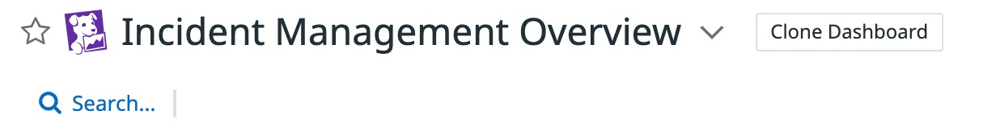
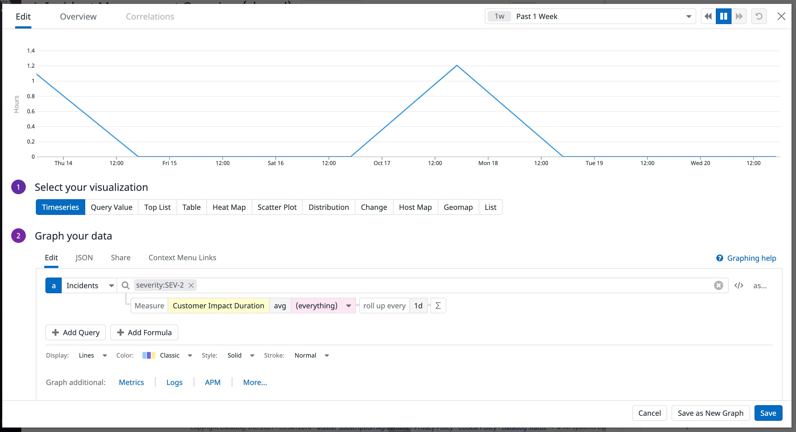

As time moves on and incidents come and go, it is important to be able to check the history of your incident response process. Is the process efficent? Is the workload distributed fairly? Where can things be improved? To answer these questions, you're going to need aggregated statistics that can tell a story about how your incident response process is fairing over time.

Datadog provides you with a queryable Incident Management Analytics data source, so you can leverage the Dashboard and Notebook widgets you're familiar with to create incident reports, landing pages, and more! In order to help you get started, Datadog also provides a [Dashboard template](https://app.datadoghq.com/dash/integration/30523/incident-management-overview?from_ts=1634171657095&to_ts=1634776457095&live=true) and [Notebook template](https://app.datadoghq.com/notebook/template/11/incident-management-overview) for helping you get started. You can clone either of these templates and customize the clones as necessary.

Let's head to the Dashboard template, [here](https://app.datadoghq.com/dash/integration/30523/incident-management-overview?from_ts=1634171657095&to_ts=1634776457095&live=true)

To explore the queries in this Dashboard and customize them, we first need to clone the Dashboard to make our own editable copy. To do so click the `Clone Dashboard` button at the top of the page next to the title of the Dashboard. 

Give your cloned Dashboard the title: `[your initials] Workshop Analytics`{{copy}}

Take a minute to explore the Dashboard and try to edit any of the widgets to see what the different queries look like. **Note:** Make sure to set the time range to `Past 1 Week` in the top right corner of your screen.

You'll see that Incident Management Analytics is currently supported in the following widgets:

- Timeseries
- Top List 
- Query Value

Let's try adding a new Timeseries widget from scratch that visualizes the Daily Mean Customer Impact Duration for SEV-2 incidents:

1. Click the `Add Widgets` button next to the title of the Dashboard
2. Click and hold the `Timeseries` option and drag it to the top of the Dashboard
4. Right to the left of the yellow textbox in Step 2 of the editor, you should see a dropdown menu that reads `Metrics`. Open the dropdown menu and select `Incidents` instead.
5. You should now see a different query editor, with a large search bar and a yellow textbox with an `*` in it. This yellow text box is our measure. Click the textbox and select `Customer Impact Duration`
6. Type `severity:SEV-2` into the search bar above the yellow textbox to filter our measure down to just SEV-2 incidents
7. By default the aggregator to the right of the measure should be `avg`. Leave this as is since we are looking to visualize Mean Customer Impact Duration.
8. Change the rollup option from `(auto)` to `1d` to get daily data point for this measure
9. Click `Save`

You've now queried Incident Management Analytics for the first time. Of course, in a real world scenario you're going to want to query many different aspects of your incident response. We encourage to explore creating other widgets and making different queries for Incident Management Analytics yourself.

This brings us to the conclusion of this workshop. Thank you for joining!

