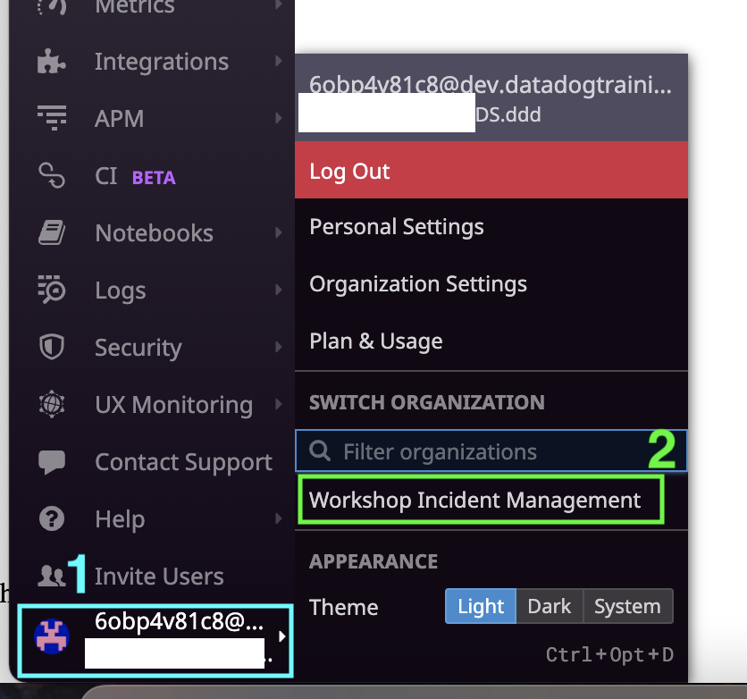

At Datadog, a single account (tied to an email address) can be a member of multiple organizations. For this workshop, we are going to be working out of a central organization, "Workshop Incident Management", tied to the instructor's environment.

By now, your Datadog account should have been added to this organization. You will need to switch to this organization within the Datadog UI.

Click on your name in the bottom left of the Datadog UI and select the "Workshop Incident Management" organization. If you don't see this organization, refresh the page. If you still don't see it, send one of the TAs the Datadog username from the `creds`{{execute}} command.

You will use this organization for the rest of this workshop.
