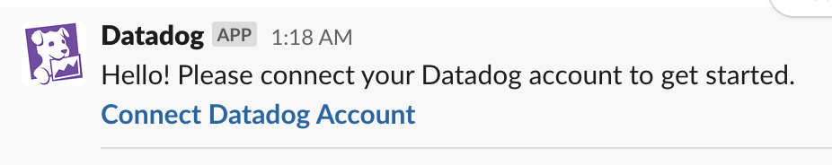
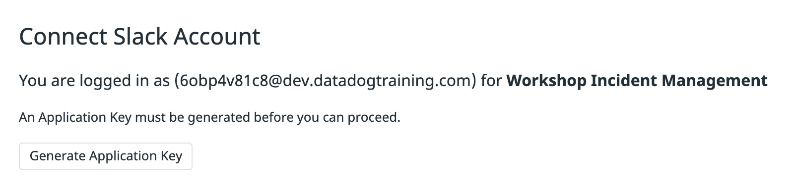

You should already be signed into the [Slack workspace](https://2021-im-workshop.slack.com/) for this workshop. If you are not or did not receive an invite, please let a TA know.

The Slack integration is already installed for the Datadog organization, but additional steps are needed to connect _your_ Datadog/Slack identity.

Within Slack, type the `/datadog` command to see the available Datadog Slack commands. You'll notice at the top a prompt to "Connect Datadog Account":

Click this and follow the prompts to generate an application key:

And sign in with Slack:

Your account should now be connected. Please ask a TA for help if you have any problems.
