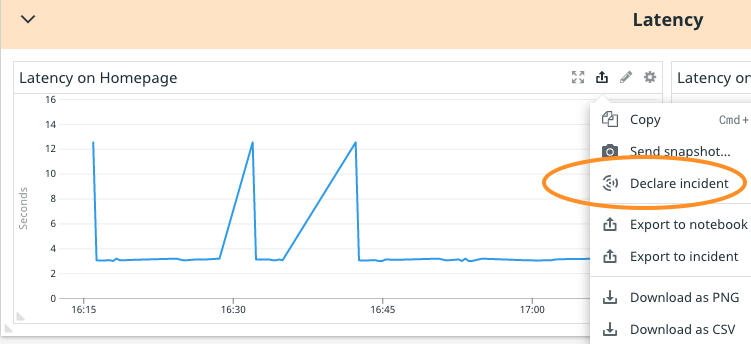

In Datadog, you can declare an incident from several locations within the app. You are going to be declaring one from a dashboard graph, but you could just as easily declare an incident from:
- The Datadog clipboard: 

- The navigation:

- A button on a monitor:

Navigate to the monitor in the "ALERT" status from the previous step. The **MESSAGE** section contains a link to the Storedog Dashboard. Click this link to view the dashboard.

The first widget graphs the same metric as the monitor. Declare an incident from here by hovering over the upper-right corner of the widget to reveal the action icons. Click on the **Export icon** and then select **Declare incident**. 

The resulting modal will ask you to assign some properties to the incident:

- Title - Give the incident a title of `[your initials] Latency Issue on Homepage`{{copy}}
- Severity - Leave this as unknown for right now, you will come back to this once you know some more about the incident.
- Incident Commander - Here you can assign someone to lead the incident investigation. Since the lab account is a standalone account, leave this assigned to you. (Note that in this lab, your username is a string of random alphanumeric characters.)
- Notifications - You can notify others about this incident. In your normal Datadog account, you would include other people, but not in this lab environment.
- Context and Signals - You'll see that Datadog has already included the graph as a signal that you are raising this incident from. You can attach other signals here by pasting them, but for now just leave it as is.

When you have finished filling out the title in the modal, click the **Declare Incident** button at the bottom to complete creation of the incident.
