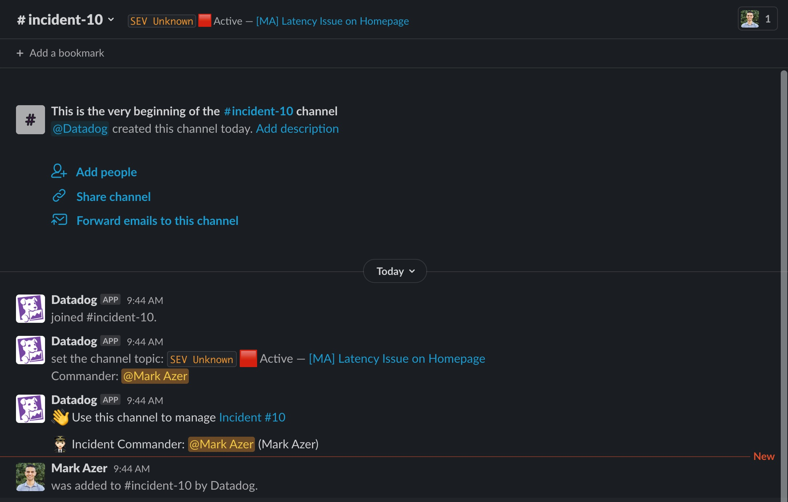
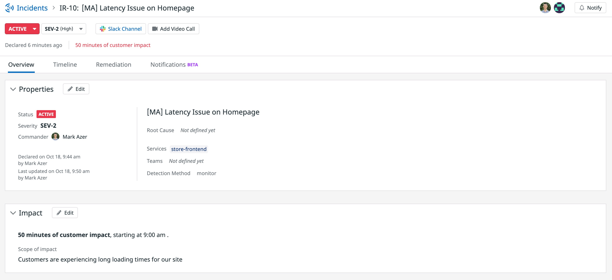

After creating the incident, you are taken to the Incident Overview page (if you get an Incident Management welcome screen, click **Get Started**). You'll notice some of the fields that you filled out in the previous step here, as well as some new ones.

Communicating with your team during an incident is extremely important. You want to make sure that the response to the incident is handled in a deliberate manner. By knowing the actions that individuals are making in response to an incident, you can properly correlate the observations that you make about your application.

Since the organization is connected to the Slack workspace, you'll see a notification in the `#incident-updates` channel with details about your incident (and more from other workshop participants). It also created a dedicated Slack channel for your specific incident. In a real world scenario this incident channel would be the place you go to collaborate with fellow responders to resolve the incident.

Because this incident was opened from a graph, you're able to see a live view of it in the **Timeline** tab of the incident. You can click the **external link** icon in the upper-right corner of the graph to view it fullscreen in the context of the Storedog Frontend Dashboard.

After some investigation here (full details of how to come to this conclusion are in the Introduction to Application Performance Monitoring course), you've determined that the service affected is `store-frontend` and that requests to the home page are slow.

Back on the incident **Overview** tab, you now have a bit more information to describe the incident. Click **Edit**. You can select `store-frontend` as the affected service, and also set `Monitor` as the detection method. Click **Save**.

You now know that customers are affected since it appears to be happening on all requests to the home page. Edit the customer **Impact** section to say that "Yes" there is an impact which is `Customers are experiencing long loading times for our site`{{copy}}.

Note that you can adjust the start timestamp here - maybe you received a support ticket or did additional research in Datadog that points to an earlier start time. For this lab, leave it at the default. We'll leave the `Active` switch turned on for now since we haven't fixed the issue yet.

Click the **Save** button.

Upon saving, you'll be prompted to adjust the severity of the incident. Now that you know customers are affected, you likely want to draw some attention to this incident from your team. For this lab, set the severity to `SEV-2`. This is one of the default severity levels provided by Datadog and is defined as a `Major issue affecting customers and users.`. If you ever want to adjust the descriptions of the severity levels for your organization, you can do so in <a href="https://app.datadoghq.com/incidents/settings" target="_datadog">**Incident Management** > **Settings**</a>.
