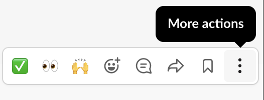
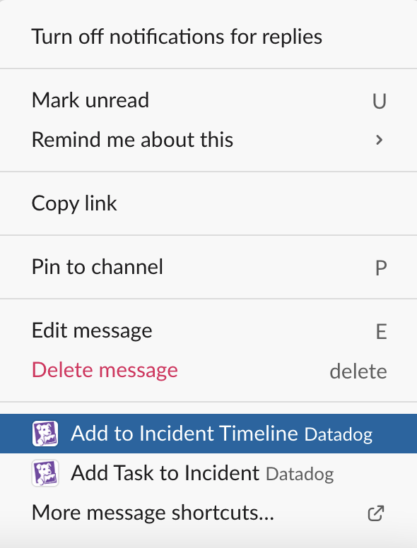

Looking at `ads.py`{{open}}, you'll notice that two `time.sleep()` commands (Lines 43-44 and Lines 66-67) were left after testing. 

Recall the task list in Slack by typing `/datadog task list` and close the "Investigate ad service code..." task. 

You now have the knowledge to declare the root cause of the incident. Edit the incident on the incident Overview tab and set *root cause* to: `Debug statements left in the ad service code`{{copy}}.

Click the **Save** button.

After this incident is resolved, you might want to consider an automated check for this type of issue. Within the incident's Slack channel send a message regarding this, `Consider an automated check for commented out code`{{copy}}. After it's sent, hover over the message and click "More actions":

And then "Add to Incident Timeline":

This message will be added to the postmortem timeline when it is generated.

You can now add a final remediation task - `Fix ad service code`{{copy}} and also assign it to the `Ad Service Engineer`.

Since all the data for this organization is coming from the Instructor's environment, please notify the instructor you are ready for the change to be made. We'll pause here while other participants determine the fix needed.

After the instructor adjusts the code, the latency issue should resolve. It may take a couple of minutes for the monitor in Datadog to turn green.

Once it does, you can:
- mark your remediation task complete
- in the customer impact section, toggle "Active" off (and adjust the end time if desired)
- change the incident status to "RESOLVED"
