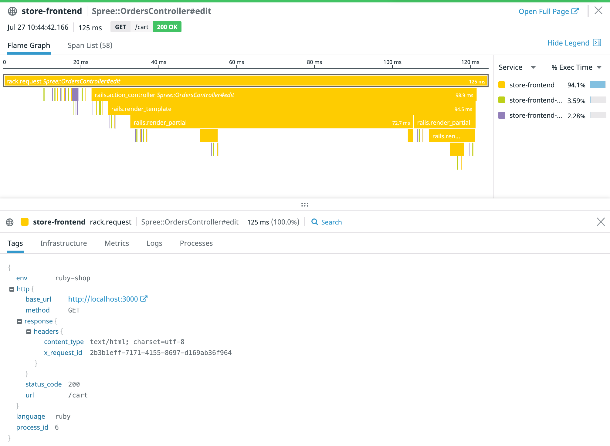

# Exploring available metrics for SLIs 

We're going to need to find metrics that can act as our SLIs. With Datadog you have several different options: you can explore and search for metrics in notebooks, across your monitors and dashboards, or across your services instrumented with APM (what we will be doing here). To dig into the services, resources, and the available metrics, let’s search our traces: https://app.datadoghq.com/apm/search 

We care about users being able to manage items in their carts so let’s scope our trace search down. In the search facets on the left, select the following: 

1. `store-frontend` from the **Service** category
2. `Spree::OrdersController#edit` from the **Resource** category

You now can see the traces for trying to access your cart. We see that none of the requests to the `Spree::OrdersController#edit` resource have resulted in errors so far. 

But eventually will look something like this when we purposely introduce errors: 

You can see that these traces consist of requests to `/cart` in the frontend service. We're going to want these requests to be successful and fast to ensure customers have a positive end user experience with storedog.

This particular request is instrumented under the `trace.rack.` namespace. So the metrics we'll focus on are called `trace.rack.request.hits` and `trace.rack.request.errors`. Let’s use this to create our first SLO. 
