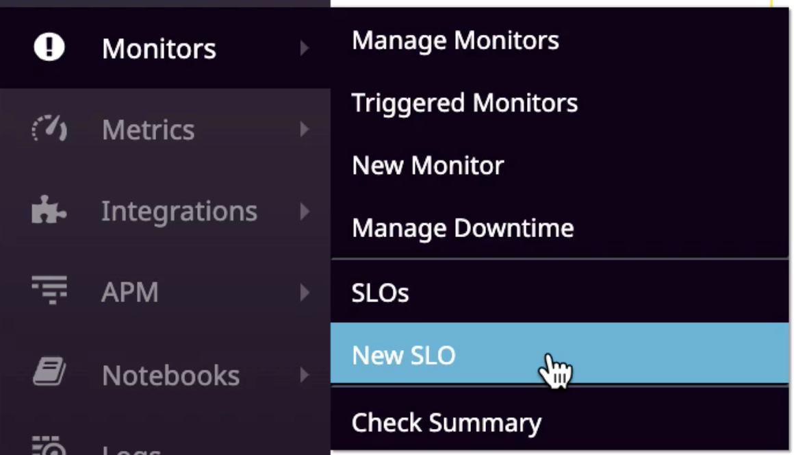
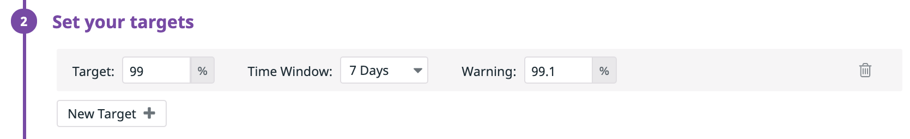
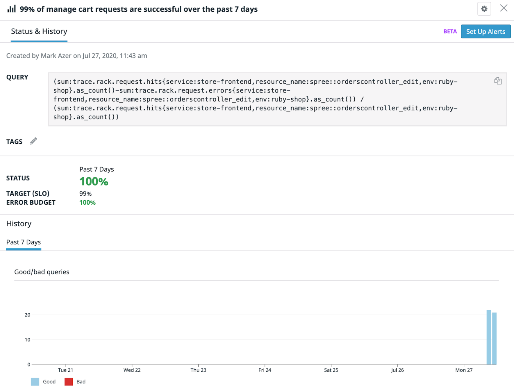

# Create a SLO

Navigate to create a new SLO to track the error rate of the requests for managing our cart. You can get there by clicking through to the sub-nav item under Monitors, **Monitors -> New SLO** or going directly to https://app.datadoghq.com/slo/new

## Identify the SLI 

There are two SLO types to pick from: `Metric Based` or `Monitor Based`.

Metric Based SLOs take a count-oriented approach to defining the SLI. The SLO will track a success ratio of a metric(s) that corresponds to good events (the numerator) over a metric(s) that correspond to total events (the denominator).

Monitor Based SLOs take a time-oriented approach to defining the SLI. The SLO will track how much time a Datadog monitor(s) spends in the ALERT state (downtime) vs a non-ALERT state (uptime).

In this case, we care about availability and error rate so we'll use a Metric Based SLO. Using this SLO type, we can set a target percentage of requests that should be successful. 

**First step:** We need to define what our good events are. In the previous step, we mentioned that we have two trace metrics we can use for these requests: `trace.rack.request.hits` and `trace.rack.request.errors`. However, these metrics correspond to total events and bad events, respectively. So how are we supposed to define good events?

Simple! Good events are just the total events minus the bad events and we can configure the numerator query with this arithmetic!

1. In the numerator field select `trace.rack.request.hits` 
2. Press the **Add Query** button, and a second metric query row will appear labelled *b*
3. For metric b, select `trace.rack.request.errors`. Since there haven’t been any errors, you’ll probably need to edit the query directly by clicking `</>` and entering `sum:trace.rack.request.errors{service:store-frontend,resource_name:spree::orderscontroller_edit,env:slo-ws-environment}.as_count()` manually. 

4. Change the expression `a + b` to `a - b`
5. For both metrics make sure to scope them down to the resource we are tracking by selecting `service:store-frontend`, `resource_name:spree::ordercontroller_edit` and `env:slo-ws-environment` in the **from** clause of both metrics. 

This subtraction query now repesents all “good” (successful) requests to manage our carts.

**Second step:** We now need to define our total events. The metric `trace.rack.request.hits` already represents total events, so select it and make sure to also scope it down to `service:store-frontend`, `resource_name:spree::ordercontroller_edit` and `env:slo-ws-environment` in the **from** clause.

## Set the SLO 

Next we set the SLO target percentage and time window we are measuring against. Click to add a new target and select 99% over a 7 day time window. You can also set an optional warning target (like 99.1% for example).

This means that we are setting an SLO to say that `99% of manage cart requests are successful over the past 7 days`{{copy}}. Set this as the title of your SLO.

*Optionally, you can add a description and tag your SLO.* 

Click **Save & Exit**! 

## View your data

Check out your data on the SLO detail page! 

Go back to the web app and view/update your cart to generate more requests!

When you first check it out, it’ll likely say 100%. With the nature of the workshop, there aren’t any errors yet (and also a low number of total events).

