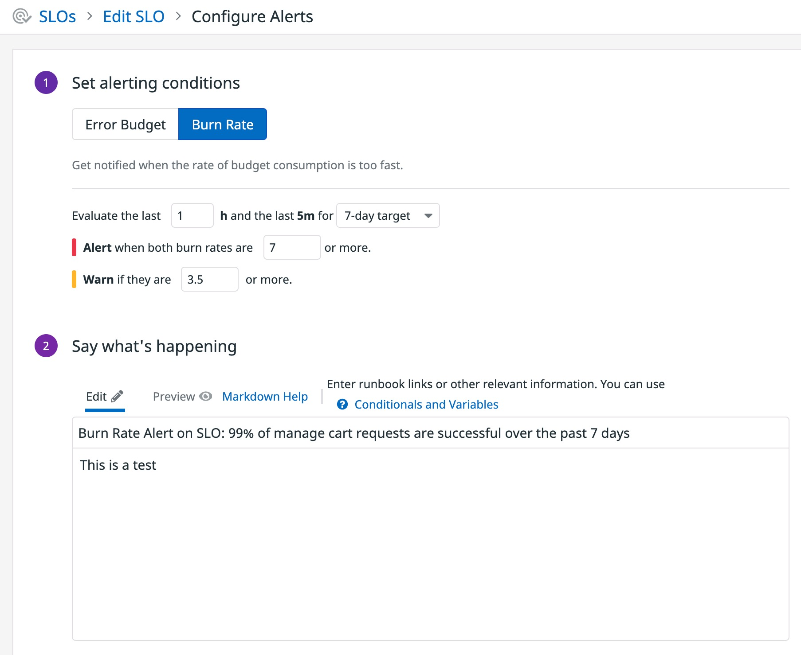

# Setting a Burn Rate Alert on our SLO

Error Budget Alerts are great for keeping a team on the same page for when to switch priorities to prevent an SLA breach, but what if you want to detect when there is an active issue that is currently depleting your error budget at an elevated rate? Based on the principles from [Chapter 5 of the Google SRE Workbook](https://sre.google/workbook/alerting-on-slos/), you can now set Burn Rate Alerts on Datadog SLOs!

Unlike Error Budget Alerts, Burn Rate Alerts are intended for active incident response. A Burn Rate Alert is composed of three components:

1. A burn rate threshold
2. A long window for evaluating the alert
3. A short window for evaluating the alert

## Burn Rates

A burn rate is a unitless number that indicates how fast your error budget is being consumed relative to the length of your SLO’s target. For example, for a 30-day target a burn rate of 1 means your error budget would be fully consumed in exactly 30 days if the rate of 1 was kept constant. A burn rate of 2 means the error budget would be exhausted in 15 days if kept constant, a burn rate of 3 means 10 days, etc.

To measure the observed burn rate your SLO experiences, a Burn Rate Alert will use the recent “error rate” in its calculation. Note that “error rate” here just means the ratio of bad behavior over total behavior during a **given time period**: 

error rate = 1 - (good behavior during time period/total behavior during time period)

In an ideal world, your SLOs would always experience a burn rate of 1; meaning you're always spending your error budget fully without overspending it. Mathematically a burn rate of 1 is equal to your error budget in fractional form: 1 - SLO Target (e.g the SLO we just created has an ideal error rate of 1 - 0.99 = 0.01). 

However, in real life issues will pop up that cause your burn rate to increase suddenly until the issue is resolved. The purpose of a Burn Rate Alert is to detect these increases and notify you about them so you can resolve the issue and bring the burn rate back down again. 

## Long and Short Windows

A Burn Rate Alert will always measure the observed error rate of your SLO during two different rolling windows simultaneously. These windows are your long window and short window. 

In order for your Burn Rate Alerts to be most useful, you want them to: 

1. Alert you when burn rate has been elevated for a significant period of time (you don't want to be notified every time a 1 second spike in burn rate happens due to a transient issue) 
2. Stop alerting you as soon as the burn rate goes back down (you want your alerts to recover when the issue itself resolves)

This is the purpose of the long window and short window, respectively.

## How Burn Rate Alerts Work

Combining your burn rate threshold, long window and short window, you get a Burn Rate Alert. Burn Rate Alerts evaluate the following formula in order to determine when to notify you:

As you can see, both the observed error rate is divided by your ideal error rate and measured during both the long window and short window to see if the burn rate threshold is violated during either time periods. If both the long window and short window measurements violate the threshold, then you will be notified. By checking both conditions, you know the alerts you get are both significant and ongoing.

## Configuring a Burn Rate Alert

Now that we've established the concepts we need, let's set our own Burn Rate Alert! 

To do this, go back to the details side panel of your SLO and select the `Set up Alerts` button. This will take you to a configuration page for you to set your Error Budget Alert. In a real world scenario, it would make sense to get notified a bit before we've completely spent our error budget, so let's set our thresholds accordingly.

1. Set the alert threshold to `7` so that the monitor is configured to notify us if our burn rate is high enough to deplete our entire error budget in one day.
2. Set the optional warning threshold. `3.5` would be a sensible choice.
3. Let's keep the long window at its default value of `1h`, the short window is automatically calculated as 1/12 of the long window based on Google's recommendations for Burn Rate Alerts.
4. Enter a monitor message in the large text box. In a real environment, you could type in `@` and select your name to receive an email notification.

Save the monitor when you're done!

In the next step, we'll purposely inject errors into our systems to see how our SLO and SLO alerts behave.
